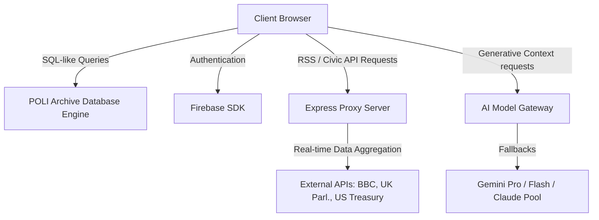

# POLI: A Geopolitical Taxonomy, Cabinet Builder, and Simulation Workspace

POLI is an academic-grade, client-first research platform designed for political scientists, policy analysts, historians, and students of statecraft. The system integrates structured historical databases, political ideology taxonomies, and regional news feeds with interactive simulation engines. It operates as a local-first React Single Page Application (SPA) supported by an Express API gateway.

---

## 1. System Architecture

The application is built upon a decoupled, client-centric architecture optimized for low-latency visual transitions, high-density data representation, and offline operations.



### 1.1 Client-Side Render Engine
* **Core Technologies**: React 19, TypeScript, and Vite for asset compilation and hot reloading.
* **Interface Layout**: Styled using custom Tailwind configurations layered with formal typography hierarchies (Inter, Merriweather, JetBrains Mono). The application implements print-safe layouts, fluid spacing densities (Compact vs. Spacious), and user-customizable border radii.
* **Motion & Transitions**: Framer Motion controls tab transitions and slide-over detail panels.

### 1.2 Local Database Layer (PADE)
* **Design**: The POLI Archive Database Engine (PADE) is a custom SQL simulation built on top of IndexedDB.
* **Resilience Fallback**: If IndexedDB is blocked (e.g., in sandboxed browser environments or private navigation sessions), the engine transitions to an in-memory database to prevent fatal startup halts.

### 1.3 Express API Gateway
* **Routing**: Coordinates requests in `server.ts`. It acts as an RSS parser, static file controller, and error logger.
* **SPA Redirection**: Implements wildcard routing (`*`) to direct deep-linked client routes back to `index.html` in production.
* **Client Telemetry**: Collects runtime front-end exceptions via the `/api/log-error` telemetry endpoint.

---

## 2. Directory Layout and File Organization

```
/
├── App.tsx                    # Application entry point, router, and global state
├── index.tsx                  # ReactDOM bootstrap wrapped in a global ErrorBoundary
├── index.html                 # Main template template containing styles and configuration
├── index.css                  # Core stylesheet and font imports
├── server.ts                  # Express server for API routing and static delivery
│
├── components/                # UI Modules and Interactive Sheets
│   ├── ErrorBoundary.tsx      # Front-end crash protection and backend error reporting
│   ├── Layout.tsx             # Shell wrapper (Header, bottom navigation, dynamic themes)
│   ├── ReaderView.tsx         # Document viewer with built-in multi-format citation generator
│   ├── tabs/                  # Main Tab components (Home, Almanac, Explore, Games, etc.)
│   ├── country/               # Geography, demographic, and economic subpanels
│   └── game/                  # Simulation games (Poliverse cabinet builder, Crisis engine)
│
├── services/                  # Business Logic and Integrations
│   ├── database.ts            # SQL-over-IndexedDB service with in-memory fallback
│   ├── firebaseService.ts     # User authentication and Firebase synchronization
│   ├── common.ts              # Centralized AI client configuration with key protection
│   └── soundService.ts        # Synthesized sound effects via browser Web Audio API
│
└── data/                      # Historical and Theoretical Datasets
    ├── personsData.ts         # High-density biographies of historical figures (25K+ lines)
    └── exploreData.ts         # Taxonomy structures for ideologies and academic disciplines
```

---

## 3. Core Functional Modules

### 3.1 Geopolitical Feeds and Regional Context
The workspace aggregates international headlines by parsing RSS feeds from major international journals (BBC, Al Jazeera, Reuters, NYT, DW) through a backend parser. It matches keywords against civic databases (including the UK Parliament Members API, US Spending API, and FEC Candidate lists) to provide real-time geopolitical briefings.

### 3.2 Immersive Dossier Readability and Typography
To facilitate long-form reading, the detail sheets for countries, ideologies, universities, religions, and biographies enforce academic printing standards:
* **Alignment**: Text paragraphs are strictly set to `text-justify` and `leading-relaxed` to eliminate ragged margins.
* **Desktop Grid**: Biographies split into a two-column desktop layout that isolates historical text from chronologies.
* **Visual Density**: Padding values automatically adjust (`p-4 sm:p-8`) based on viewports to avoid layout crowding.

### 3.3 Dynamic Citation Engine
The workspace document reader includes an inline citation utility supporting standard, technical, legal, and regional style guides:
* **APA & MLA**: Automatically formats author initials, publishing years, and publisher fields according to APA 7th and MLA 9th guidelines.
* **Legal & Policy**: Generates Bluebook, ALWD, and OSCOLA formats for treaties and government filings.
* **Metadata Export**: Exports citation tags in BibTeX, RIS, EndNote, and CSL JSON formats for academic bibliographic software (Zotero, Mendeley).

### 3.4 Poliverse: Statecraft Simulation and Cabinet Builder
The statecraft simulator allows users to construct a government structure by assigning political entities (Ministers, Ideologies, Laws) into cabinet seats.
* **Scoring Metrics**: As entities are placed, the simulator calculates Structural Integrity, Ideological Alignment, Economic Viability, and Social Cohesion.
* **Resilient HUD Drawer**: The system diagnostics panel functions as a collapsible overlay. On mobile devices, it collapses into a compact floating drawer to prevent layout crowding of the interactive canvas.

---

## 4. Database Schema Specification

The relational emulation schema consists of five core tables:

| Table Name | Key Attributes | Description |
| :--- | :--- | :--- |
| `users` | `id`, `username`, `email`, `level`, `xp`, `coins` | Manages user credentials, reading stats, and experience logs. |
| `saved_items` | `id`, `type`, `title`, `subtitle`, `dateAdded` | Bookmarks for historical documents, countries, and ideologies. |
| `chats` | `id`, `participantName`, `unread`, `archived` | Thread headers for simulated political debates. |
| `messages` | `id`, `conversationId`, `senderId`, `text`, `timestamp` | Message history within specific debate threads. |
| `posts` | `id`, `type`, `title`, `author`, `likes`, `comments` | User discussions and peer annotations inside the workspace. |

---

## 5. Development and Installation Guide

### 5.1 Package Installation
Download the dependencies using npm:
```bash
npm install
```

### 5.2 Environment Setup
Create a `.env` file in the root directory based on `.env.example`:
```env
GEMINI_API_KEY="your-gemini-api-key"
CLAUDE_API_KEY="your-anthropic-claude-key"
```
*Note: If no API key is specified, the application will boot with local caching and fallback presets instead of crashing.*

### 5.3 Local Development Server
Launch the compiler and Express backend in watcher mode:
```bash
npm run dev
```
Open [http://localhost:3000](http://localhost:3000) in your web browser.

### 5.4 Production Packaging
Compile and bundle the frontend assets and the server wrapper for deployment:
```bash
npm run build
npm start
```
This command builds the static distribution files into the `dist/` directory and serves them through the production server.
